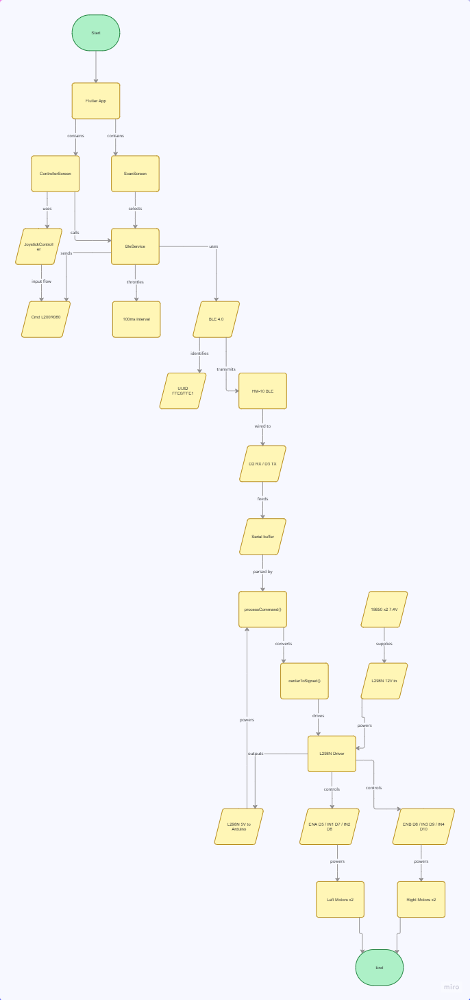

# ble_rc_car_app

Flutter + Arduino로 만든 4WD RC카 블루투스 컨트롤러

---

## 기술 스택

- **Flutter** — Android 앱 (BLE 컨트롤러)
- **Arduino Uno R3** — RC카 제어
- **HM-10** — BLE 4.0 통신 모듈
- **L298N** — 모터 드라이버

---

## 프로젝트 구조

```
lib/
├── main.dart
├── screens/
│   ├── scan_screen.dart        # BLE 디바이스 검색 & 연결
│   └── controller_screen.dart  # 조이스틱 조종 화면
├── services/
│   └── ble_service.dart        # BLE 연결 / 명령 전송
└── widgets/
    └── joystick.dart           # 아날로그 조이스틱 + 탱크드라이브 믹싱
```

---

## 시스템 흐름

```
[Flutter 조이스틱]
      ↓  (x, y) 좌표
[탱크 드라이브 믹싱]
  left  = y + x
  right = y - x
      ↓  "L200R060\n"  (100ms 간격)
[HM-10 BLE]
      ↓  UART 9600bps
[Arduino]
  → L298N PWM 제어
  → 모터 4개 구동
```

---

## 통신 프로토콜

```
주행:  L{0~255}R{0~255}\n    (128 = 정지, 255 = 최대전진, 0 = 최대후진)
정지:  S\n
```

예시

| 명령 | 동작 |
|------|------|
| `L255R255\n` | 직진 |
| `L0R0\n` | 후진 |
| `L255R0\n` | 제자리 우회전 |
| `L220R140\n` | 전진하며 우곡선 |

---

## 하드웨어 배선

| Arduino | 연결 대상 | 설명 |
|---------|---------|------|
| 3.3V | HM-10 VCC | ⚠️ 반드시 3.3V!! |
| D2 | HM-10 TXD | BLE 수신 |
| D3 | HM-10 RXD | BLE 송신 |
| D5 PWM | L298N ENA | 좌측 속도 |
| D6 PWM | L298N ENB | 우측 속도 |
| D7 / D8 | L298N IN1 / IN2 | 좌측 방향 |
| D9 / D10 | L298N IN3 / IN4 | 우측 방향 |
| 5V | L298N 5VOUT | Arduino 전원 수전 |

> L298N의 ENA, ENB 점퍼를 제거해야 PWM 속도 제어됨.

전원: 18650 × 2 직렬 (7.4V) → L298N 12V 단자

---


> 아두이노 업로드 시 HM-10 D2/D3 선을 잠깐 분리.

---

## 주요 의존성

```yaml
flutter_blue_plus: ^2.2.1  
permission_handler: ^12.0.1
```
  

  
  
  
---
  